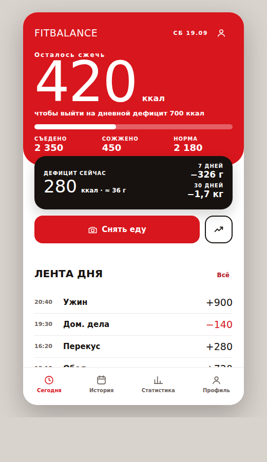
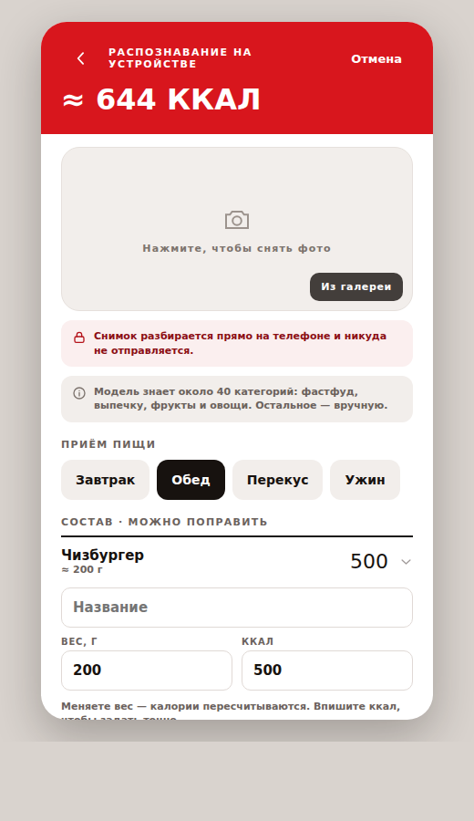
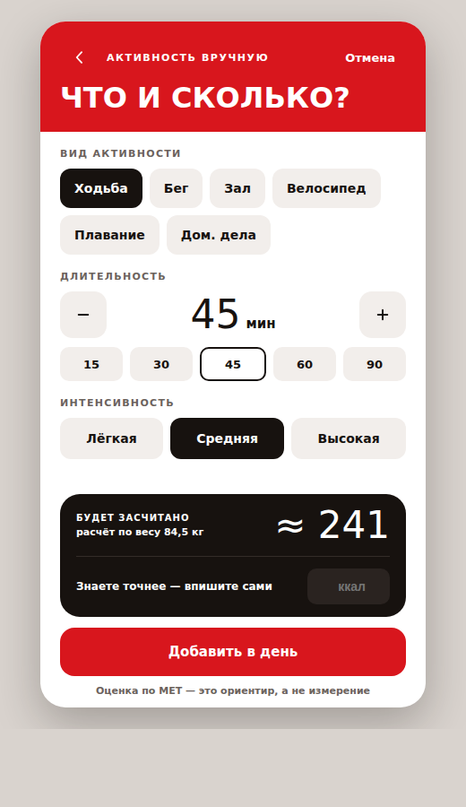
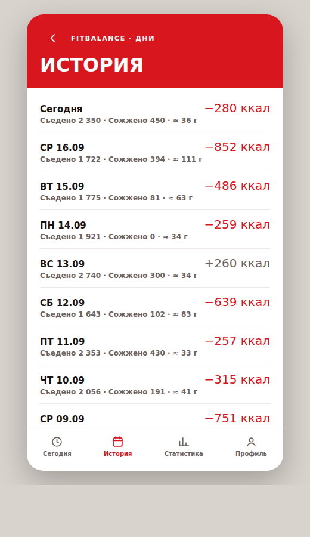
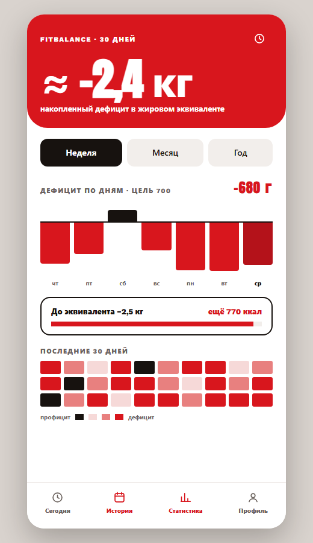

# FitBalance

A mobile-first PWA for tracking calories in and calories out, built around a single question:
**how much is left to burn today?**

### ▶︎ [vladcherry.github.io/fit-balance](https://vladcherry.github.io/fit-balance/)

Open it on a phone and install it to the home screen — the app offers to do that itself, with
step-by-step instructions on iOS, where Safari has no install API.

Swiping left and right moves between the four tabs. On the photo and activity sheets a drag from
the left edge goes back instead, which matters once the app is installed: a PWA on iOS has
neither a system back gesture nor browser chrome to borrow one from.

> **Status: prototype.** `prototype/` is a clickable, installable static prototype of the chosen
> design: on-device food recognition, an editable diary, a day history and statistics that come
> from the recorded days rather than from fixed mock-up numbers. The real application has not been
> started yet; this repository holds the prototype, the product spec and the decision log.

| Today | Meal | Activity | History | Stats |
| --- | --- | --- | --- | --- |
|  |  |  |  |  |

## What it does

Open the app and immediately see the state of the day:

- how much is still left to burn to hit the day's deficit target — the headline number;
- how much was eaten today;
- how much was burned through activity;
- the daily maintenance requirement;
- the current deficit, and its approximate fat equivalent in grams.

Food is logged by photographing the plate, or by hand. Either way the result is a list of items
whose name, weight and calories can all be edited — change a weight and the calories follow the
item's kcal-per-100 g. Activity is entered by hand: pick the type, the duration and the
intensity, and the app estimates the calories from MET and body weight.

Everything already written to the diary stays editable: tapping an entry opens its time, its
calories and what it was, or removes it. At midnight the day closes into the history, which is
what the history screen lists and what the statistics are calculated from.

The daily maintenance requirement is derived from the body data in the profile — sex, age, height
and weight, through Mifflin-St Jeor — and can be typed over by hand when the user knows better.

## The headline number

The home screen leads with **calories left to burn**, not with a remaining food budget.

```
maintenance            2200 kcal
daily deficit target    700 kcal

eaten today            2350 kcal
burned today            450 kcal

current deficit  = 2200 + 450 - 2350 =  300 kcal  (~39 g fat equivalent)
left to burn     =  700 - 300        =  400 kcal
```

Total intake sits next to it in small type.

## Fat equivalent

Calorie balance is also shown in grams, using the conventional figure of
**7700 kcal ≈ 1 kg of fat equivalent**. This is a motivational aid, not a body-composition
measurement: day-to-day weight also moves with water, glycogen and gut contents. Every such
figure is rendered with `≈` and labelled as an approximation.

## Recognition

Photographing a plate runs a real classifier on the phone: **MobileNet V2 on TensorFlow.js**, with
the runtime and the weights served from this app's own origin. The first use of the photo screen
downloads ~15 MB once, with the progress shown; from then on it works offline.

The model's taxonomy is ImageNet's, so roughly forty of its classes are edible — fast food, baked
goods, fruit, vegetables. A burger or a banana lands well; a home-cooked plate of chicken and rice
has no class, and the app says it recognised nothing instead of inventing a number. The photo
screen states that limit on screen. Recognised food arrives as a draft: the name, the weight and
the calories are all editable, weaker guesses are offered as one-tap alternatives, and manual
entry is always there. Details and what is deliberately missing (detection, portion estimation)
are in [docs/on-device-recognition.md](docs/on-device-recognition.md).

### The second opinion

ImageNet's forty classes do not cover a home-cooked plate, so there is an optional cloud path for
the photos the on-device model cannot name. It is **never automatic**: with an API key set in the
profile, the photo screen grows an "Ask the cloud" button, and pressing it sends *that one*
picture — downscaled to 768 px — to the configured model. The default is DeepSeek's
`deepseek-flash`; the endpoint and model are settings, and the call is the usual OpenAI-shaped
`POST /chat/completions`, so any compatible provider works.

DeepSeek and Gemini have one-tap presets in the profile; anything else is a matter of typing an
endpoint. Keys are stored per provider host, so switching between them never overwrites one with
the other. The key is typed into the app and lives in that browser's localStorage: it is not in
this repository, not in the deployed files, and it is sent to the configured endpoint and nowhere
else. The profile explains where to obtain one and links to that provider's key page.

**Developer mode**, also in the profile, adds a collapsed panel under the photo with the model's
full reply — status, round-trip time, token usage, `finish_reason`, how many items survived
validation, and the raw text itself. It is the fastest way to see why a reply produced fewer
items than expected, and it is off by default.

## Privacy

With no cloud key configured — the default — meal photos are analysed **on the device** and never
leave it. The picture is held as an object URL inside the page, and the on-device recognition path
makes no network request at all, not even to a model CDN.

The cloud path is the single exception, and it is drawn that way: it needs a key, it needs a press
per photo, and the screen says where the picture is about to go before it goes. Nothing is
uploaded in the background, and no photo is ever stored.

## Languages

The interface ships in **Russian and English** from the first release, switchable in the profile.
Everything inside the repository — code, comments, commit messages, documentation — is
**English only**.

## Documentation

| Document | What's in it |
| --- | --- |
| [docs/product-spec.md](docs/product-spec.md) | Full product specification |
| [docs/decisions.md](docs/decisions.md) | Decision log — what was chosen and why |
| [docs/on-device-recognition.md](docs/on-device-recognition.md) | How on-device photo analysis works, and what it costs |
| [docs/food-recognition-api.md](docs/food-recognition-api.md) | Analysis of cloud food-recognition APIs (the road not taken) |
| [docs/design.md](docs/design.md) | Visual direction, design tokens, screen inventory |

## Working on the prototype

No build step, no package manager — plain HTML, CSS and three scripts (`app.js`, the on-device
`recognise.js`, the optional cloud `cloud.js`). The vendored TensorFlow.js build
(`prototype/vendor/`) and the model weights (`prototype/model/`) are committed as they are served.
No API key is committed, and none is needed to run the app.

```bash
python -m http.server 5173 --directory prototype
```

Then open <http://localhost:5173>. A service worker is involved, so use a normal reload if a
change does not appear.

| Command | What it does |
| --- | --- |
| `python tools/make-icons.py` | Regenerate the PWA icons |
| `bash tools/make-screenshots.sh` | Regenerate the README screenshots from the running prototype |

`?seed=meal` pre-fills a meal without running the model, which is how the screenshots are taken.

### Deployment

Every push to `main` that touches `prototype/` is deployed to GitHub Pages by
[.github/workflows/deploy-pages.yml](.github/workflows/deploy-pages.yml). The workflow stamps
`version.json` with the commit SHA, which the app shows under **Profile → App** along with an
update button.
